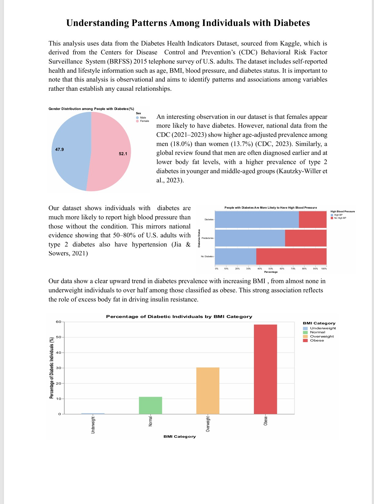
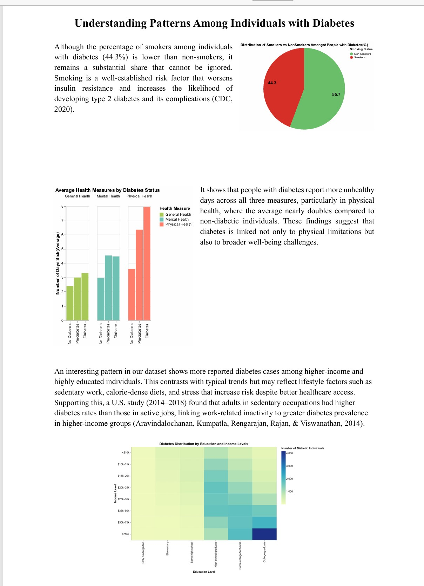

# Understanding Patterns Among Individuals with Diabetes 

Shumaila Abbasi 

## Description

This project analyzes data from the Diabetes Health Indicators Dataset (Kaggle), which originates from the CDC's 2015 Behavioral Risk Factor Surveillance System (BRFSS) survey of U.S. adults.  The analysis explores patterns and associations among these variables to better understand risk factors associated to diabetes, while acknowledging that the findings are observational and not causal.

## Data Sources

Teboul, A. (n.d.). Diabetes Health Indicators Dataset Notebook [Notebook]. Kaggle. https://www.kaggle.com/code/alexteboul/diabetes-health-indicators-dataset-notebook/notebook

Reminder: Your final PDF/HTML also **must** contain citations for your data.