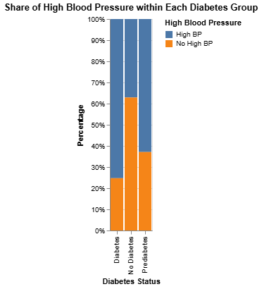
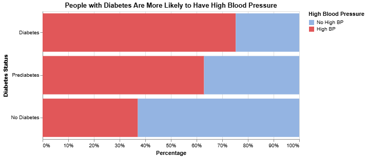
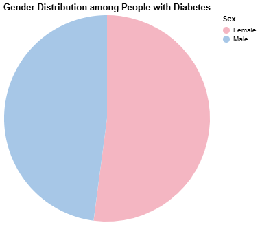
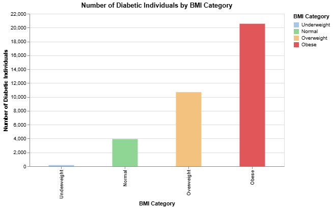
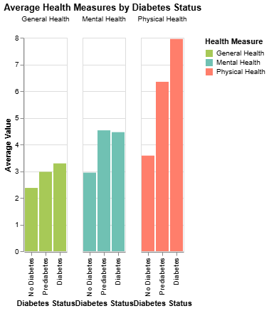
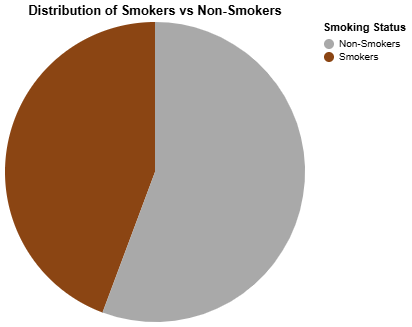
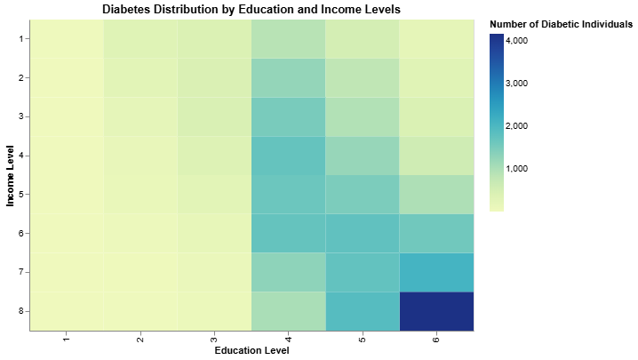
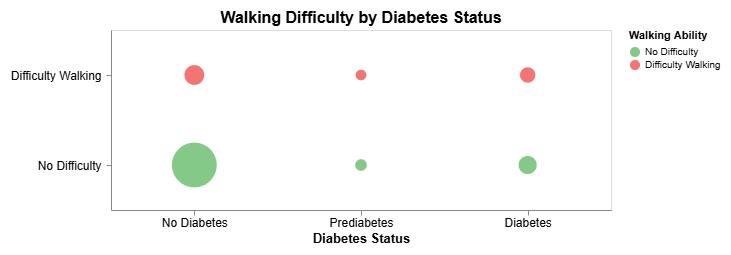

# {Diabetest}

{Shumaila Abbasi}

## What is your current goal? Has it changed since the proposal?
    To identify risks factors that can help predict diabetes. Previously, I had planned on conducting a state-wise analysis, but now I will be only focusing on the risk factors that can be associated with diabetes. 
## Are there data challenges you are facing? Are you currently depending on mock data?
No data challenges 

## Describe each of the provided images with 2-3 sentences to give the context and how it relates to your goal.
1. People with Diabetes Are More Likely to Have High Blood Pressure':

    

    
    

    This chart highlights the strong association between diabetes and high blood pressure. It emphasizes that individuals with diabetes are significantly more likely to experience hypertension, identifying it as a major risk factor for diabetes management and prevention.
2. Gender Distribution among People with Diabetes: 

    

    This visualization shows that females have a slightly higher prevalence of diabetes than males. The difference may partly stem from conditions such as pregnancy-induced diabetes, underscoring the importance of gender-specific healthcare awareness.
4. 'Number of Diabetic Individuals by BMI Category': 

    
    This chart illustrates how diabetes risk increases with higher body mass index (BMI). It reinforces that maintaining a healthy weight is an important preventive measure against developing diabetes.
5. 'Average Health Measures by Diabetes Status: 

    
    This visualization combines general, mental, and physical health indicators to explore how overall well-being correlates with diabetes. It reveals that poorer health outcomes across these dimensions are associated with a higher likelihood of having diabetes.
6. Distribution of Smokers vs Non-Smokers 

    
    

    This chart compares the proportion of smokers and non-smokers in the dataset. It helps evaluate whether smoking is a significant behavioral risk factor linked to diabetes prevalence.
7. Diabetes Distribution by Education and Income Levels
    This heatmap shows how diabetes prevalence varies across different education and income groups. It provides insights into the socioeconomic determinants of health

    

8. Walking Difficulty by Diabetes Status
    This visualization compares walking difficulty among people with and without diabetes. It highlights how diabetes is often associated with mobility limitations, pointing to the broader physical health impacts of the disease.

    

## What form do you envision your final narrative taking? (e.g. An article incorporating the images? A poster? An infographic?)
Communicate how lifestyle, demographic, and socioeconomic factors relate to diabetes prevalence through Infographics 